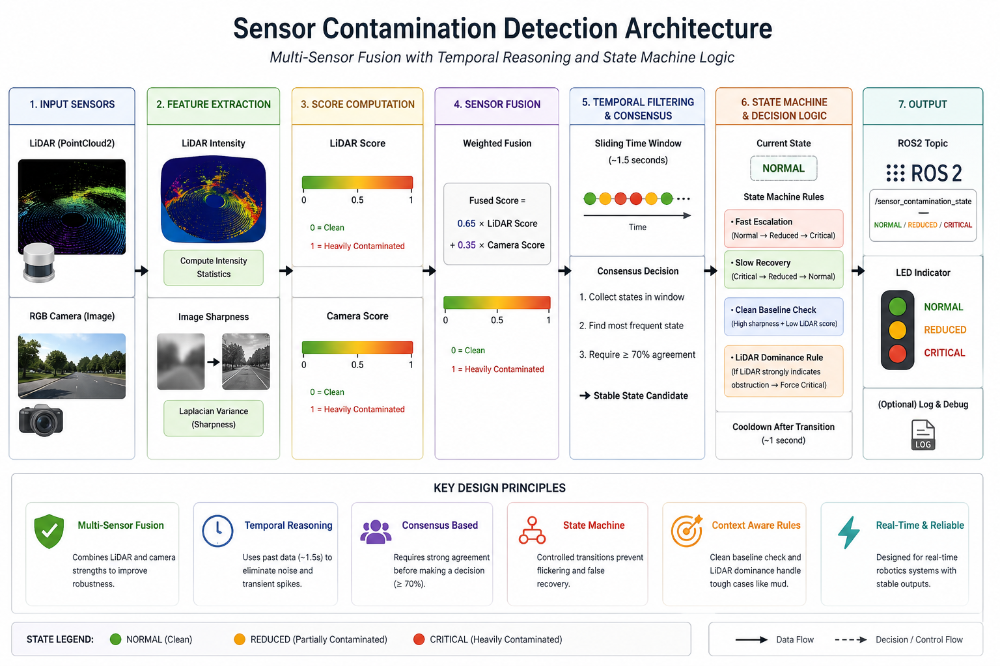
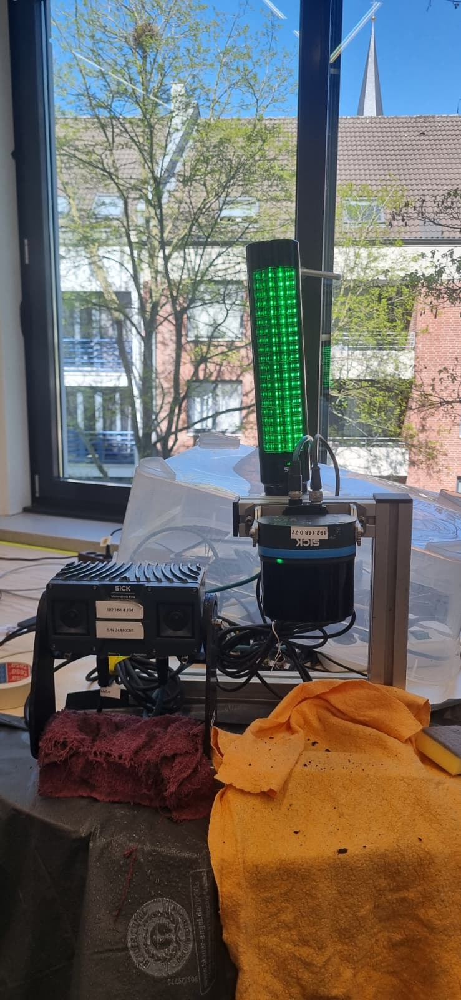
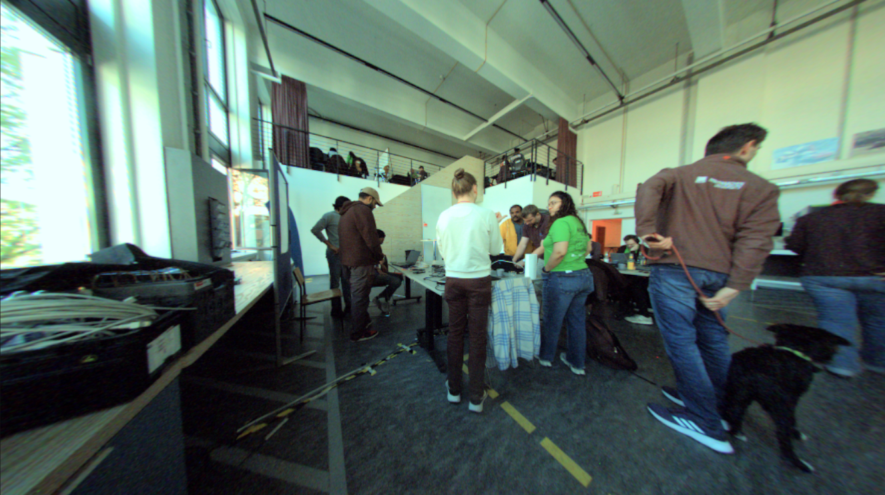
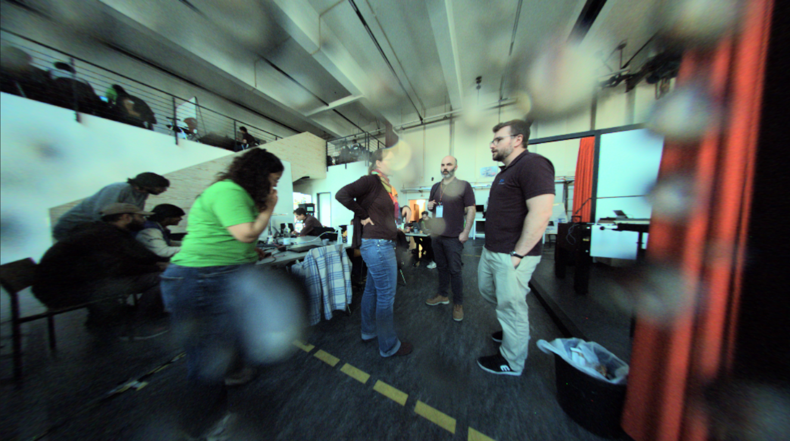
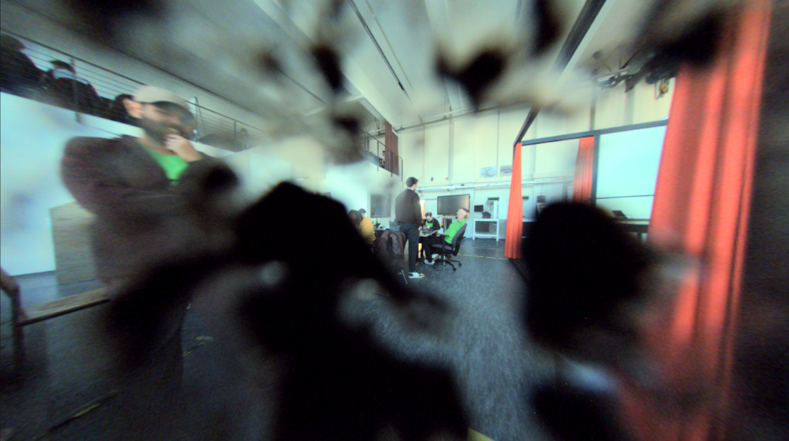
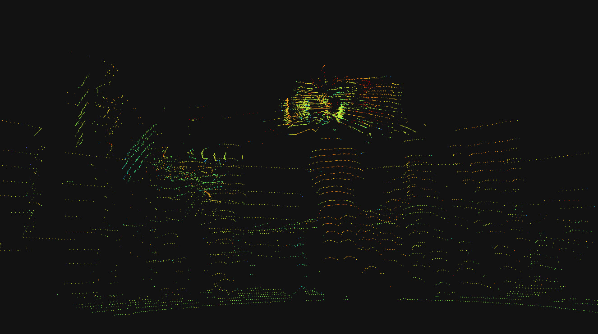
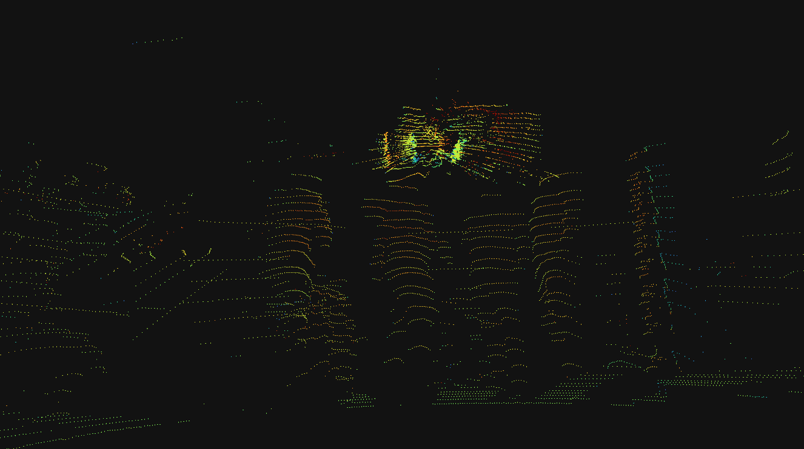
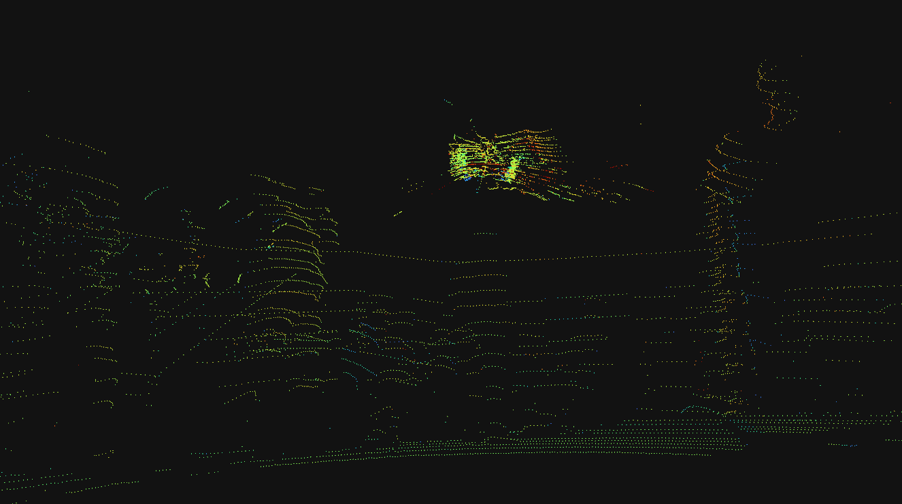

# 🚦 Real-Time Sensor Contamination Detection for Robotics (ROS2)

Detects **water, dust, and mud contamination** on LiDAR and camera sensors in real-time using multi-sensor fusion and temporal reasoning.

👉 Designed for **autonomous systems** to prevent silent sensor failure.

---

## 🎥 Demo

<table>
  <tr>
    <td align="center">
      <br>
      Contaminating sensors by spraying water.
    </td>
    <td align="center">
      <br>
      POV of contamination using water. 
    </td>
  </tr>
</table>

---

## ❗ Problem

Robotic systems rely heavily on sensors like LiDAR and cameras.

However, in real-world environments:

* 💧 Water droplets
* 🌫️ Dust accumulation
* 🟤 Mud obstruction

can silently degrade sensor performance.

🚨 The system **does not know** when its perception is unreliable.

---

## 💡 Solution

We built a real-time contamination detection system that:

* Monitors **sensor health continuously**
* Combines **LiDAR + camera signals**
* Classifies contamination into:

| State       | Meaning              |
| ----------- | -------------------- |
| 🟢 NORMAL   | Sensor clean         |
| 🟡 REDUCED  | Partial degradation  |
| 🔴 CRITICAL | Severe contamination |

* Publishes status via ROS2
* Controls LED indicators for real-time feedback

We detect contamination by monitoring:

### 📡 LiDAR signals
- Mean intensity
- Low-percentile intensity (p10)
- Near-range ratios

### 📷 Camera signals
- Blur (Laplacian variance)
- Dark pixel ratio
- Edge density

👉 These are fused into a **contamination score**

---

## 🧠 System Overview

```
LiDAR + Camera
      ↓
Feature Extraction
      ↓
Score Computation
      ↓
Sensor Fusion
      ↓
Temporal Filtering (Time Window)
      ↓
Consensus Decision
      ↓
State Machine + Rules
      ↓
Final Output
```



---

## ⚙️ Key 

* **Multi-Sensor Fusion**
  Combines LiDAR intensity and camera sharpness

* **Temporal Filtering**
  Uses recent data instead of single frames → reduces noise

* **Consensus-Based Decision**
  Changes state only when confident

* **State Machine Logic**
  Prevents flicker and unstable transitions

* **LiDAR Dominance Rule**
  Ensures persistent contamination (e.g., mud) is not missed

---

## 📷 Real-World Data

Data collected manually using:
- RGB Camera (from SICK AG)
- LiDAR sensor (from SICK AG)



Scenarios:
- Clean
- Dust
- Water spray
- Mud contamination

---


## 📊 Results

### 📷 Camera Observations

| Clean                        | Water                        | Mud                        |
| ---------------------------- | ---------------------------- | -------------------------- |
|  |  |  |

---

### 📡 LiDAR Point Cloud

| Clean                        | Water                        | Mud                        |
| ---------------------------- | ---------------------------- | -------------------------- |
|  |  |  |

👉 Notice how any form of contamination degrades signal quality.

---

## 🚀 Features

* Real-time contamination detection
* Works with LiDAR + RGB camera
* Robust to:

  * Water spray
  * Dust
  * Mud
* ROS2-based architecture
* Hardware-ready (LED output integration)

---

## 🛠️ Tech Stack

* ROS2 (Jazzy)
* Python
* OpenCV
* NumPy

---

## ▶️ How to Run

```bash
colcon build
source install/setup.bash
ros2 run contamination_demo contamination_monitor_node
```

---

## 🧠 Key Insight

Instead of reacting to single noisy measurements, the system uses **temporal consensus and controlled state transitions** to ensure stable and reliable detection.

---

## 🎯 Applications

* Autonomous vehicles
* Field robotics
* Industrial inspection systems
* Safety monitoring systems

---

## 📌 Future Work

- Learning-based fusion (ML)
- Adaptive thresholds
- Self-cleaning triggers

---

## 🙌 Author and Teammates

* [Utkarsh Anand](https://utkarshanand221.netlify.app/), MS Robotics, RWTH Aachen
* Vishnucharan S, MS Robotics, RWTH Aachen
* Saimothish Ramalingam, MS Robotics, RWTH Aachen
* Kishore Satyaprakash, MS Robotics, RWTH Aachen

---

For more details on methodology and feature extraction, refer [here](docs/methodology.md).

## 📜 License

This project is licensed under the MIT License.

All work and data collection were performed independently by the author.
