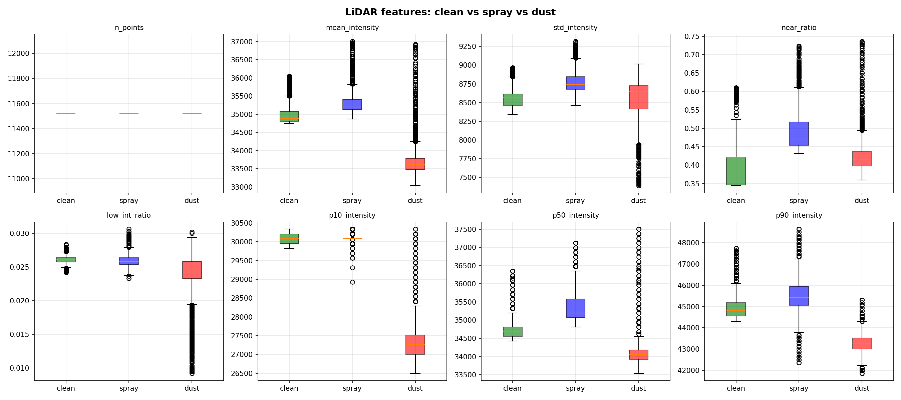
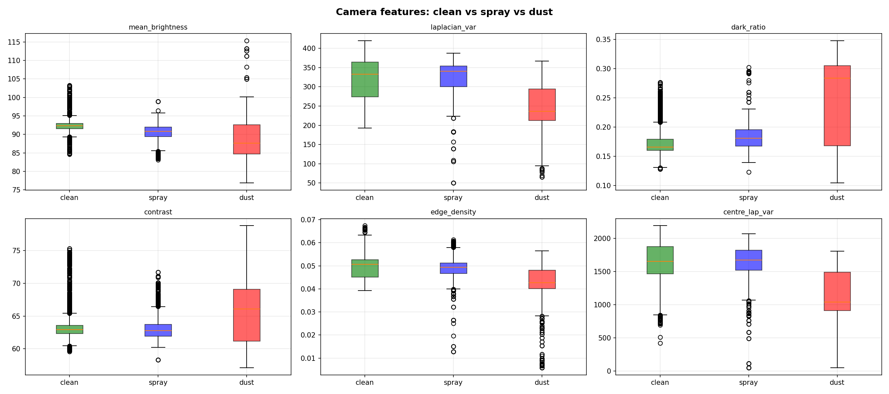
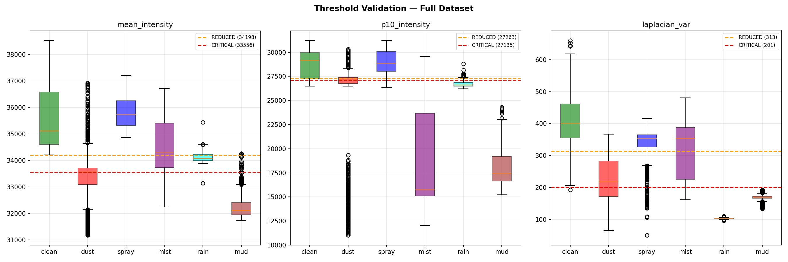
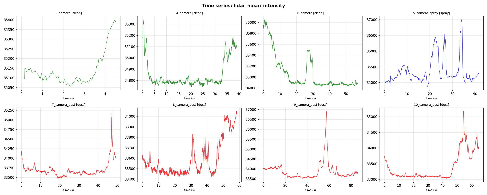
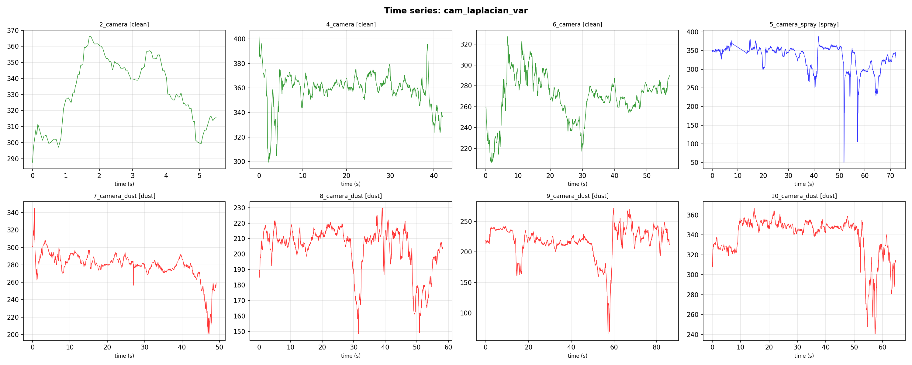
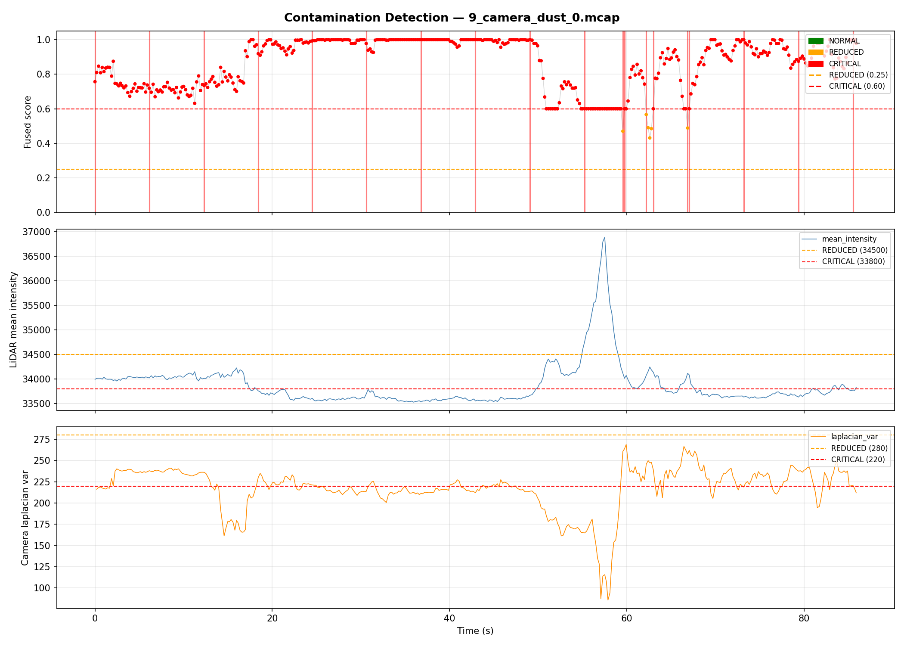
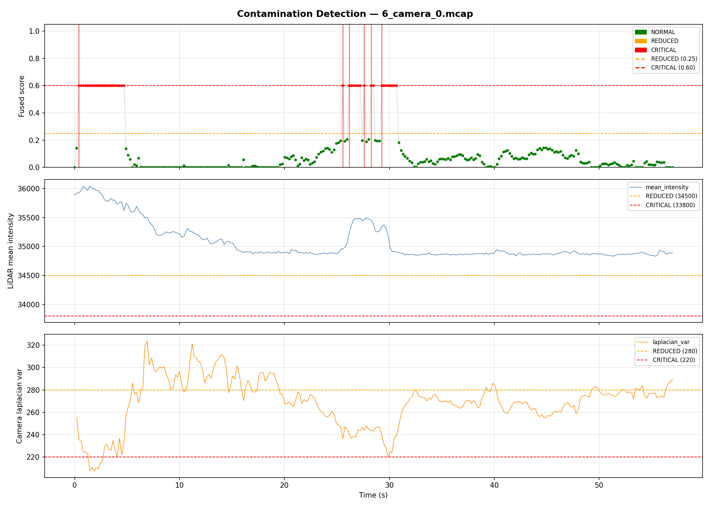

# 📘 Methodology — Sensor Contamination Detection

---

## 1. Feature Extraction

### 📡 LiDAR Features

- Mean intensity
- p10 intensity (low percentile)
- Near point ratio

---

### 📷 Camera Features

- Laplacian variance (blur detection)
- Dark pixel ratio
- Edge density

---

## 2. Feature Behavior Analysis

### LiDAR Feature Distribution

👉 Observations:
- Clean → high intensity
- Dust → reduced intensity
- Spray → moderate degradation

---

### Camera Feature Distribution

👉 Observations:
- Blur decreases Laplacian variance
- Contamination increases dark ratio

---

## 3. Threshold Selection

Thresholds were chosen using distribution analysis:

We define:

- Reduced threshold → early warning  
- Critical threshold → strong degradation  

---

## 4. Temporal Behavior

### LiDAR Intensity Over Time

---

### Camera Blur Over Time

---

👉 Key insight:
- Contamination causes **sudden drops or spikes**
- Temporal consistency improves robustness

---

## 5. Fusion Strategy

Final score:
score = w1 * lidar_score + w2 * camera_score

Then classify:

- score < 0.25 → Normal  
- 0.25–0.6 → Reduced  
- > 0.6 → Critical  

---

## 6. Validation

Example outputs:

---

## 7. Key Observations

- LiDAR alone is insufficient  
- Camera alone is unreliable in some cases  
- Fusion significantly improves detection  

---

## 8. Limitations

- Static thresholds  
- Sensor-specific tuning  
- No learning-based model yet  

---